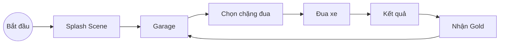
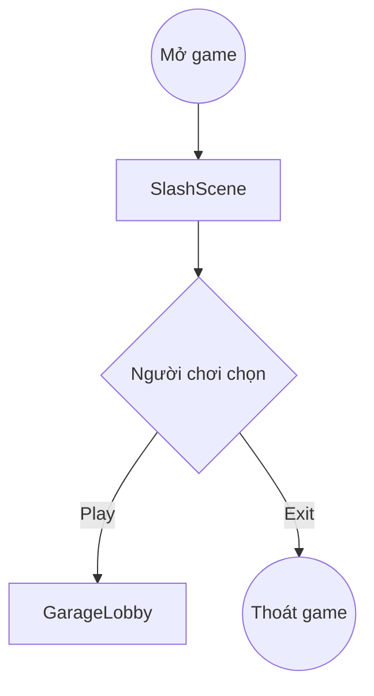
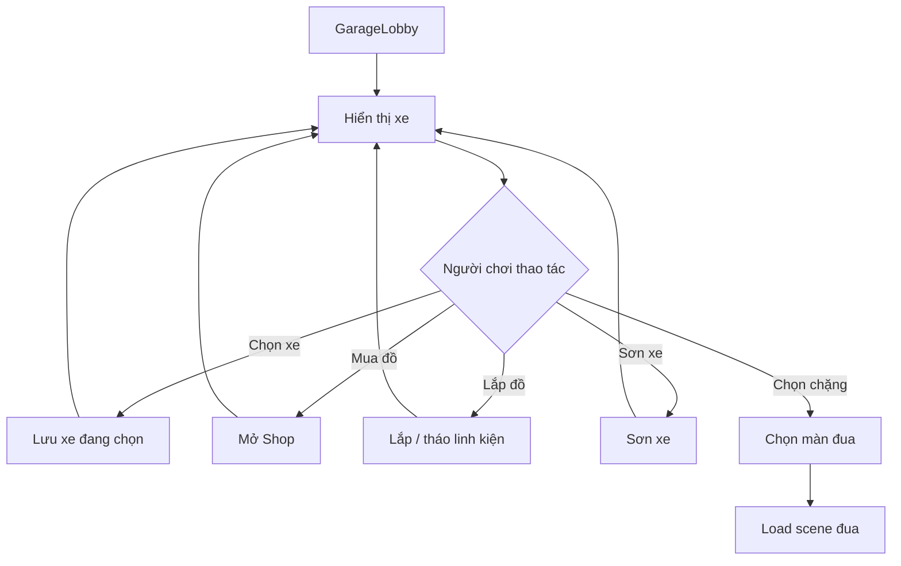
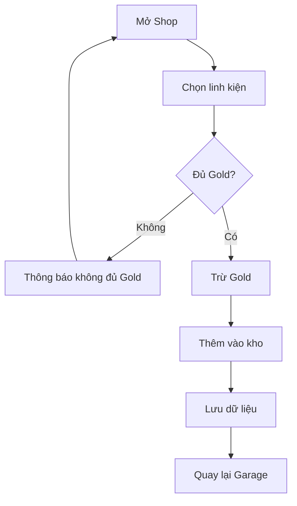
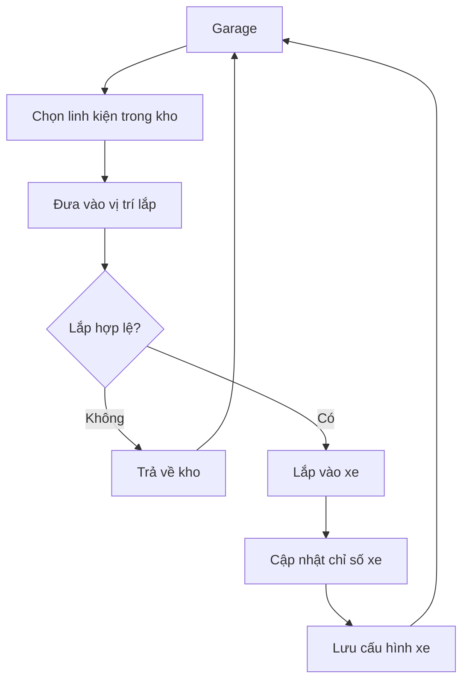
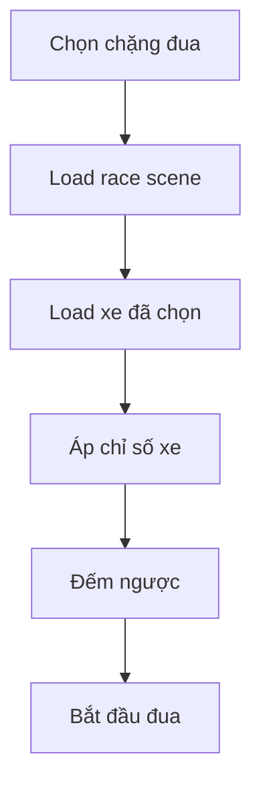
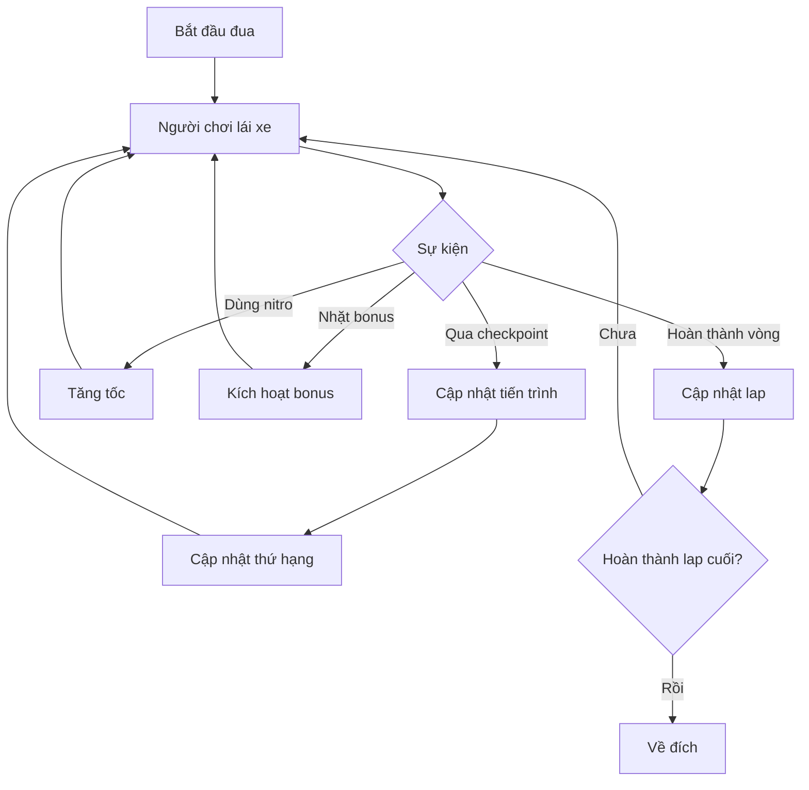
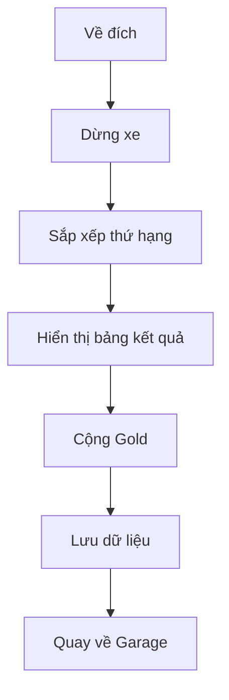

# Sơ đồ hoạt động đơn giản của dự án Furia Rush

Tài liệu này chia hoạt động của dự án thành các luồng nhỏ, mỗi luồng chỉ giữ các bước chính để dễ đưa vào báo cáo hoặc trình bày.

## 1. Luồng tổng quan

## 2. Luồng khởi động game

## 3. Luồng trong Garage

## 4. Luồng mua linh kiện

## 5. Luồng lắp / tháo linh kiện

## 6. Luồng vào màn đua

## 7. Luồng trong khi đua

## 8. Luồng kết thúc màn đua

## 9. Các script chính theo từng luồng

| Luồng | Script / asset chính |
|---|---|
| Chuyển scene | `SceneChanger`, `RaceSettings` |
| Garage | `GarageCarManager`, `GarageSaveManager` |
| Shop / Inventory | `ShopUIController`, `InventoryUIController`, `PlayerInventory` |
| Linh kiện xe | `WheelSocket`, `BrakeSocket`, `CarPart`, `PlayerCarLoadout` |
| Load xe vào race | `ActiveLoadout`, `LoadSceneController`, `LevelController` |
| Đua xe | `VehicleController`, `RacePositionTracker`, `CheckpointTrigger` |
| Nitro / bonus | `NitroController`, `SpeedBoost`, `BonusReceiver` |
| Kết quả | `RaceResultsController` |
